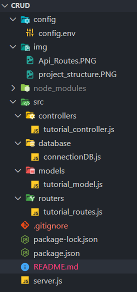
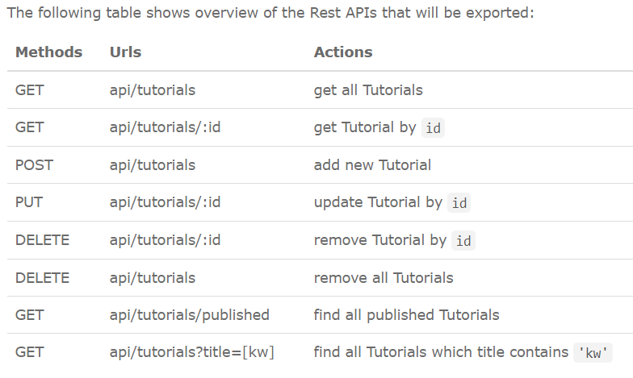

# CRUD operation REST API (NodeJS, ExpressJS, MongoDB)

## Intro:

- In this Project, we will build Restful API that can create, retrieve, update, delete of Tutorials CRUD Operations APP.
- First, we start with an Express web server. Next, we add configuration for MongoDB database, create Tutorial model with Mongoose, write the controller. Then we define routes for handling all CRUD operations (including custom finder).
- Finally, we gonna test the REST API using Postman.

## Project Structure



## Project set up:

```
npm install
```

## Database Config

- Put the MONGO_URI into <b>config/config.env<b>

## Run Project

```
npm run dev
```

## API Routes


